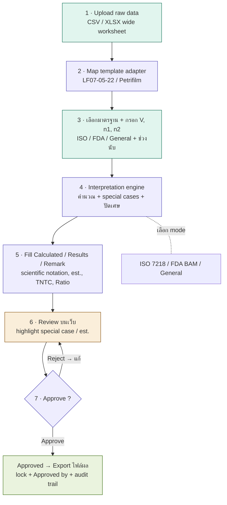

# Diagrams — Application แปลผลเชื้อจุลินทรีย์

## 1. Process Flow



## 2. Data Model (ER)

```mermaid
erDiagram
    Role ||--o{ User : has
    User ||--o{ Batch : uploads
    User ||--o{ ApprovalLog : acts
    Batch ||--o{ Sample : contains
    Batch ||--o{ ApprovalLog : tracked_by
    Sample ||--o{ DilutionRow : has
    Sample ||--|| Result : produces
    MethodConfig ||--o{ Sample : configures

    Role { int id PK; string name }
    User { int id PK; int role_id FK; string name; string email }
    Batch { int id PK; int uploaded_by FK; string file_name; string standard; float V; int n1; int n2; string status }
    Sample { int id PK; int batch_id FK; string lab_code; int replicate; string analyte; string method FK }
    DilutionRow { int id PK; int sample_id FK; int replicate_no; float dilution; string count_raw }
    Result { int id PK; int sample_id FK; string calculated; string result; string remark; string unit }
    ApprovalLog { int id PK; int batch_id FK; int actor_id FK; string action; string reason; datetime timestamp }
    MethodConfig { string method PK; string standard; float range_min; float range_max; string unit; int sig_figs }
```
